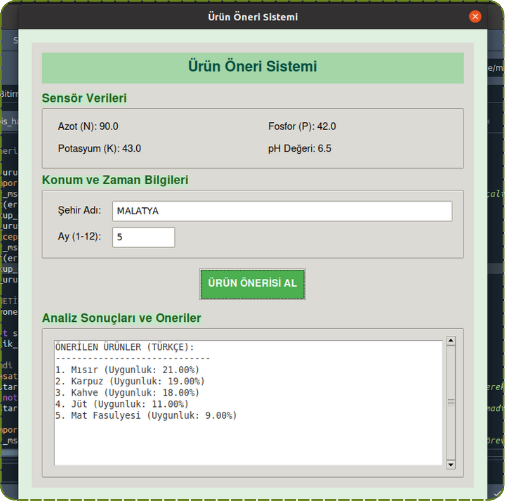
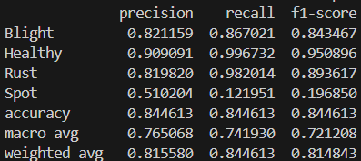
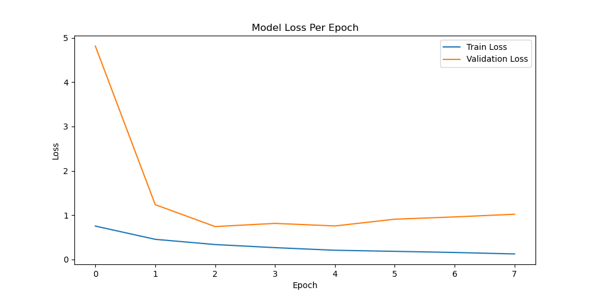

# Akıllı Tarım ve Bitki Takip Sistemi

## Proje Hakkında
Bu proje, makine öğrenmesi ve yapay zeka tekniklerini kullanarak tarımsal süreçleri optimize etmeyi, hastalık tespitini otomatikleştirmeyi ve bitki büyüme analizlerini gerçekleştirmeyi amaçlayan kapsamlı bir akıllı tarım sistemidir. Sistem, sensör verilerini, hava durumu istatistiklerini ve kamera görüntülerini entegre ederek çiftçilere ve araştırmacılara eyleme dönüştürülebilir içgörüler sunar.

## Özellikler
- **Hastalık Tespiti:** Görüntü işleme ve derin öğrenme modelleri kullanılarak bitkilerdeki (örneğin mısır) hastalıkların erken teşhisi.
- **Bitki Büyüme Analizi:** Kamera modülü ile periyodik olarak alınan görüntüler üzerinden bitki boyu ve gelişim durumunun hesaplanması.
- **Ürün Öneri Sistemi:** Çevresel faktörler (sıcaklık, nem, yağış vb.) ve toprak yapısı baz alınarak en uygun tarım ürününün önerilmesi.
- **Otomatik Sulama:** Sensör verilerine dayanarak optimum sulama zamanlamasının belirlenmesi ve uygulanması.
- **Meteorolojik Veri Entegrasyonu:** MGM (Meteoroloji Genel Müdürlüğü) verilerinin çekilerek bölgesel iklim analizlerinin yapılması.
- **Görev Yöneticisi:** Belirli aralıklarla donanımların ve algoritmaların otonom bir şekilde çalıştırılması.

## Modüller ve Dosya Yapısı
- `Ana_kodlar.py`: Sistemin temel bileşenlerini başlatan ve yöneten ana uygulama dosyası.
- `hastalik_tespiti_modulu.py`: Yapay zeka modelleri ile görüntü üzerinden bitki hastalıklarını analiz eden modül.
- `buyume_analizi_modulu.py`: Görüntü işleme teknikleri ile bitki büyümesini ölçen modül.
- `urun_oneri_modulu.py`: İklim ve çevre verilerini kullanarak tarlaya uygun ürünü öneren makine öğrenmesi modülü.
- `otomatik_sulama_modulu.py`: Toprak nemine bağlı olarak sulama sistemini tetikleyen modül.
- `kamera_modulu.py` / `merkezi_sensor_modulu.py`: Kamera ve sensör donanımlarıyla iletişimi sağlayan donanım entegrasyon dosyaları.
- `saatlik_gorev_yoneticisi.py`: Periyodik işlemleri zamanlayan arka plan servisi.
- `MGM_verilerini_donusturme.py` / `MGM_sehir_ortalamalari_alma.py`: İklimsel veri setlerinin işlenmesi ve analize uygun formata getirilmesi.

## Kurulum
1. Projeyi bilgisayarınıza klonlayın:
   ```bash
   git clone <repo_url>
   cd proje-dizini
   ```
2. Gerekli kütüphaneleri yüklemek için sanal ortam (virtual environment) oluşturmanız önerilir:
   ```bash
   python -m venv venv
   # Windows için:
   venv\Scripts\activate
   # Linux/MacOS için:
   source venv/bin/activate
   ```
3. Gerekli Python paketlerini yükleyin. (Projeye özel kütüphaneler kurulmalıdır):
   ```bash
   pip install tensorflow pytorch opencv-python scikit-learn pandas numpy
   ```

## Kullanım
Projenin ana işlevlerini başlatmak için konsol üzerinden ana dosyayı çalıştırabilirsiniz:
```bash
python Ana_kodlar.py
```
Otomatik görev yöneticisini (örneğin saatlik sensör okumaları ve analizler) başlatmak için:
```bash
python saatlik_gorev_yoneticisi.py
```

## Makine Öğrenmesi Modelleri ve Veri Setleri
Proje içerisinde boyutları büyük olan eğitimli ağırlık dosyaları (`.h5`, `.keras`, `.pth`, `.pkl`) ve veri setleri (`.csv`, `.xlsx`) kullanılmaktadır. Bu dosyalar veri boyutunu küçültmek ve git geçmişini temiz tutmak amacıyla `.gitignore` ile repodan hariç tutulmuştur. Eğer projeyi başka bir ortamda çalıştıracaksanız, bu dosyaların ilgili dizinlerde bulunduğundan emin olun.

## Teknolojiler
- Python
- TensorFlow / Keras
- PyTorch
- OpenCV
- Scikit-Learn
- Pandas & NumPy

## Ekran Görüntüleri ve Performans Grafikleri

### Proje Ekran Görüntüleri



### Model Performans Metrikleri




### Büyüme Oranı (Growth Rate) Analizi


## Lisans
Projenin kullanım hakları proje geliştiricilerine aittir. Kodu kullanmadan, kopyalamadan veya dağıtmadan önce izin alınması önerilir.
